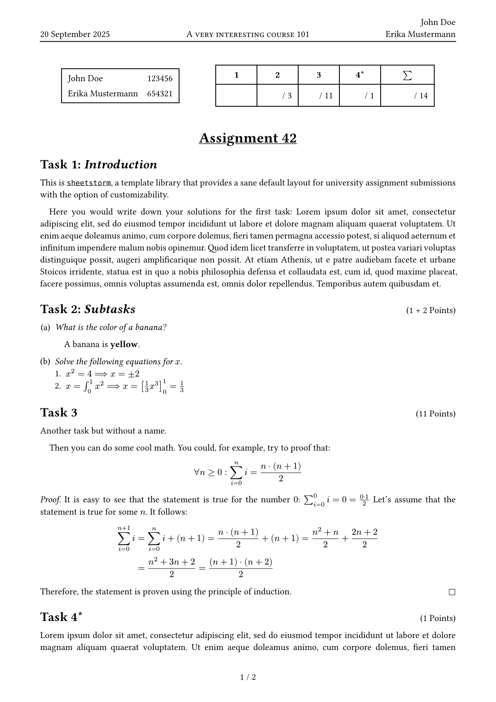

# sheetstorm
A Typst template for university exercise sheets.

## Quick Start

### Template CLI
```sh
typst init @preview/sheetstorm
```

### Import
```typst
#import "@preview/sheetstorm:0.3.3"
```

## Example
```typst
#import "@preview/sheetstorm:0.3.3" as sheetstorm: task

#show: sheetstorm.setup.with(
  course: smallcaps[A very interesting course 101],
  title: "Assignment 42",
  authors: (
    (name: "John Doe", id: 123456),
    (name: "Erika Mustermann", id: 654321),
  ),

  info-box-enabled: true,
  score-box-enabled: true,
)

#task(name: "Introduction")[
  This is #link("https://github.com/rabuu/sheetstorm")[`sheetstorm`],
  a template library that provides a sane default layout for university assignment submissions with the option of customizability.

  Here you would write down your solutions for the first task:
  #lorem(100)
]

// ...
```

See [here](./template/main.typ) for full example template.

### Preview


### More examples
More examples can be found [here](./examples).
